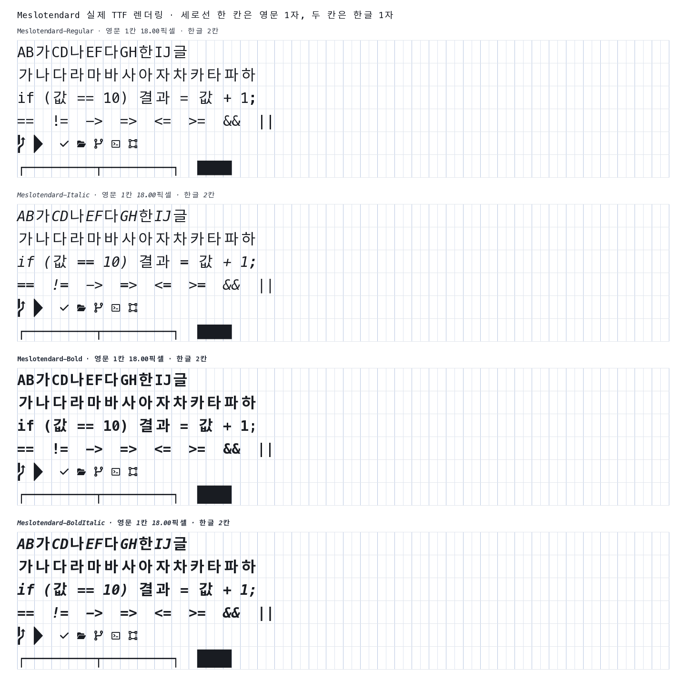

# Meslotendard

Meslotendard는 [younjungpark/Monatendard](https://github.com/younjungpark/Monatendard)에서
포크한 한글 코딩 글꼴 프로젝트입니다.

MesloLGS Nerd Font Mono의 영문·아이콘과 Pretendard의 한글을 결합합니다.
폰트 패밀리 하나만 설치하면 Nerd Font 아이콘과 완전 고정폭을 함께 사용할 수 있으며,
한글 한 글자는 영문 정확히 두 칸을 차지합니다. 코딩 리게이처는 포함하지 않습니다.



## 제공 파일

- `Meslotendard-Regular.ttf`
- `Meslotendard-Bold.ttf`
- `Meslotendard-Italic.ttf`
- `Meslotendard-BoldItalic.ttf`

일반판, 웹폰트, Windows 설치 스크립트는 제공하지 않습니다.

## 다운로드

[최신 Meslotendard.zip 직접 다운로드](https://github.com/cLazyZombie/Meslotendard/releases/latest/download/Meslotendard.zip)

압축을 푼 뒤 운영체제의 기본 글꼴 설치 기능으로 TTF 네 파일을 설치하고,
편집기나 터미널에서 `Meslotendard`를 선택하세요.

## 빌드와 검증

Python 3.11 이상과 [uv](https://docs.astral.sh/uv/)가 필요합니다.

```sh
./build.sh
```

개별 단계는 다음과 같습니다.

```sh
uv sync --all-groups
uv run meslotendard fetch
uv run meslotendard build --all
uv run meslotendard verify --reproducible
uv run meslotendard render
uv run meslotendard package
```

원본 버전·URL·SHA256과 글리프 배율은 `sources.lock.toml`에 고정됩니다.
검증기는 다음 항목을 자동으로 확인합니다.

- 모든 ASCII와 Nerd 아이콘이 영문 한 칸 폭인지
- 모든 한글·전각 CJK가 두 칸이고 유니코드 반각 문자가 한 칸인지
- `==`, `!=`, `->` 등의 연산자가 다른 형태로 치환되지 않는지
- 고정폭 메타데이터, 셀 연결 문자, 글리프 잘림, 빌드 재현성
- 실제 advance가 정확히 1:2인지, 여러 픽셀 크기의 반올림 오차가 1픽셀 이내인지

## 라이선스

결과 폰트는 Pretendard의 조건에 따라 SIL Open Font License 1.1로 배포합니다.
Meslo LG의 Apache License 2.0과 Nerd Fonts에 포함된 각 아이콘 원본의 고지를 함께 보존합니다.
자세한 원본·수정 내역은 `FONTLOG.md`와 `licenses/THIRD_PARTY_NOTICES.md`를 확인하세요.

Meslotendard는 Meslo, Pretendard, Nerd Fonts 프로젝트의 공식 배포판이 아닌 독립 파생물입니다.
